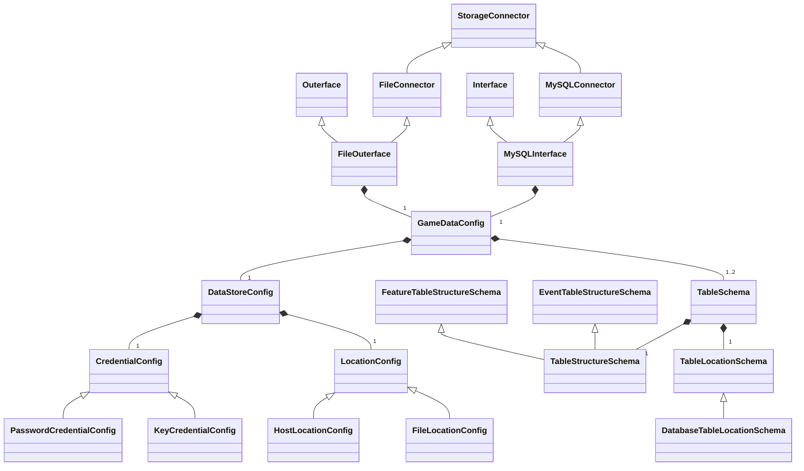

## Introduction to Data Storage and Interfaces

### `StorageConnector`s, `Interface`s, and `Outerface`s

OpenGameData uses classes called `StorageConnector`s to establish connections to data stores.

Data stores may include a local file, an external file host, or a database:

```{mermaid}
---
title: Basic Data Stores
---
flowchart TD

StorageConnector --> local[(Local File)]
StorageConnector --> remote[(Remote Fileserver)]
StorageConnector --> Database[(Database)]
```

However, each data store might in turn contain multiple resources, such as files or database tables:

```{mermaid}
---
title: Detailed Data Stores
---
flowchart TD

StorageConnector --> local[(Local File)]
StorageConnector --> remote[(Remote Fileserver)]
remote[(Remote Fileserver)] -.-> file1.tsv
remote[(Remote Fileserver)] -.-> file2.tsv
remote[(Remote Fileserver)] -.-> file3.tsv
StorageConnector --> Database[(Database)]
Database[(Database)] -.-> database1
database1 -.-> table1
database1 -.-> table2
Database[(Database)] -.-> database2
database2 -.-> table3
```

We use `Interface` and `Outerface` classes are used for data input and output, where an `Interface` class has specific functions for retrieving data from a store, and an `Outerface` has functions for writing data to a store.
For any given storage medium, then, there may be a `Connector`, `Interface`, and `Outerface` class. In the example below, we show how the `MySQLConnector`, `MySQLInterface`, and `MySQLOuterface` are related:

```{mermaid}
---
title: Storage Connector Hierarchy
---
classDiagram
StorageConnector <|-- MySQLConnector
Interface <|-- MySQLInterface
MySQLConnector <|-- MySQLInterface
MySQLConnector <|-- MySQLOuterface
Outerface <|-- MySQLOuterface
```

In this hierarchy, we separate connection logic from data I/O, with a common base class called `StorageConnector` to handle connection logic. `Interface` and `Outerface` base classes exist independently as mixin classes that define a set of functions for reading or writing data.
Then for any data storage medium we want to support, we write a subclass of `StorageConnector`, e.g. `MySQLConnector`, to take in the corresponding config and call appropriate functions from whatever MySQL library is in use.
To create an actual `Interface` or `Outerface` for MySQL, we would create `MySQLInterface` or `MySQLOuterface` that inherits from `MySQLConnector` and `Interface`/`Outerface`.

<!-- ```mermaid -->
<!-- classDiagram
StorageConnector <|-- MySQLConnector
MySQLConnector <|-- MySQLInterface
Interface <|-- MySQLInterface
StorageConnector <|-- FileConnector
FileConnector <|-- FileOuterface
Outerface <|-- FileOuterface -->
<!-- ``` -->

### Summary of Interface Class Relationships

Putting together all the various classes described in the sections below, and hiding direct connections where certain configs/schemas are passed to an upper-level class through lower-level classes, the proposed refactor/redesign can be summarized as follows:



(for additional details, see [Proposal #61](https://github.com/opengamedata/ogd-common/discussions/61) on GitHub)