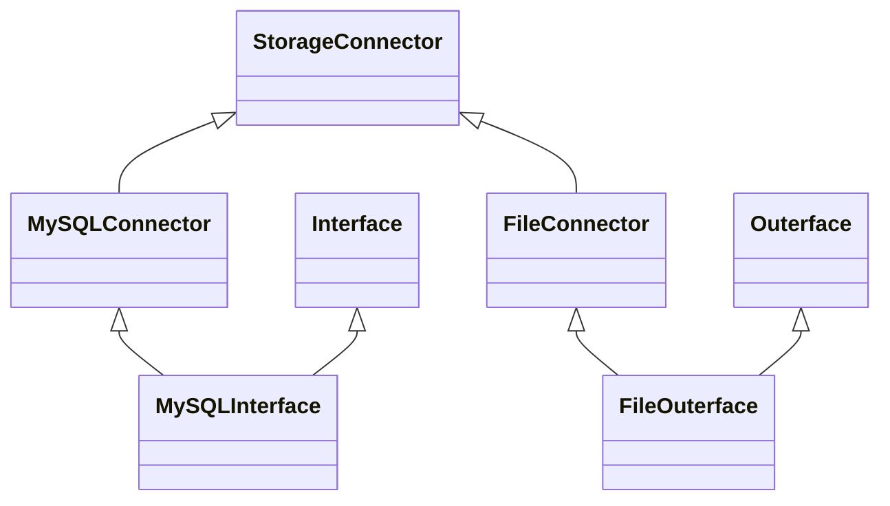
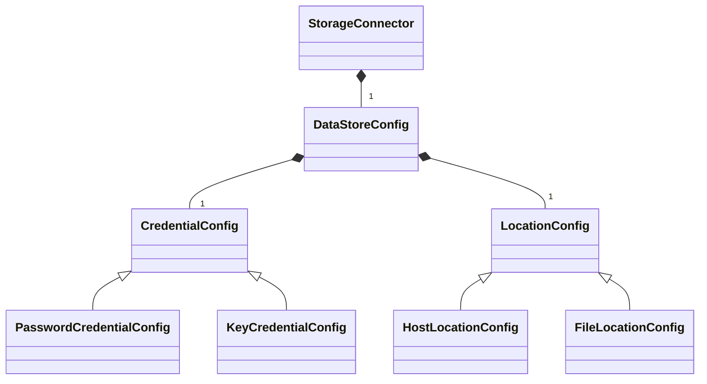
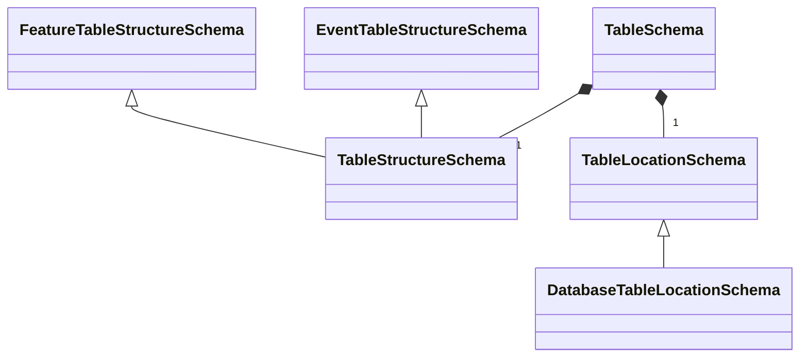

## Introduction to Data Storage and Interfaces

### `StorageConnector`s, `Interface`s, and `Outerface`s

OpenGameData uses classes called `StorageConnector`s to establish connections to data stores.

Data stores may include a local file, an external file host, or a database:

```{mermaid}
---
title: Basic Data Stores
---
flowchart TD

StorageConnector --> local[(Local File)]
StorageConnector --> remote[(Remote Fileserver)]
StorageConnector --> Database[(Database)]
```

However, each data store might in turn contain multiple resources, such as files or database tables:

```{mermaid}
---
title: Detailed Data Stores
---
flowchart TD

StorageConnector --> local[(Local File)]
StorageConnector --> remote[(Remote Fileserver)]
remote[(Remote Fileserver)] -.-> file1.tsv
remote[(Remote Fileserver)] -.-> file2.tsv
remote[(Remote Fileserver)] -.-> file3.tsv
StorageConnector --> Database[(Database)]
Database[(Database)] -.-> database1
database1 -.-> table1
database1 -.-> table2
Database[(Database)] -.-> database2
database2 -.-> table3
```

Further, `Interface` and `Outerface` classes are used for data input and output, where an `Interface` class has specific functions for retrieving data from a store, and an `Outerface` has functions for writing data to a store.
For any given storage medium, then, there may be a `Connector`, `Interface`, and `Outerface` class:

```{mermaid}
---
title: Storage Connector Hierarchy
---
classDiagram
StorageConnector <|-- MySQLConnector
Interface <|-- MySQLInterface
MySQLConnector <|-- MySQLInterface
MySQLConnector <|-- MySQLOuterface
Outerface <|-- MySQLOuterface
```

File input and output via `Interface` and `Outerface` classes is significant enough to deserve a chapter of its own.
Thus, please refer to Unit 4, Chapter 3: Interfaces and Outerfaces for details.

In the new hierarchy, we separate connection logic from data read, creating a common base class called `StorageConnector` to handle connection logic. Then `Interface` and `Outerface` classes are set up independently as mixin classes that define a set of functions for reading or writing data.
Then for any data storage medium we want to support, we write a subclass of `StorageConnector` as e.g. `MySQLConnector` to take in the corresponding config and call appropriate functions from whatever (in this case) MySQL library is in use.
To create an actual `Interface` or `Outerface` for MySQL, we would create `MySQLInterface` or `MySQLOuterface` that inherits from `MySQLConnector` and `Interface`/`Outerface`.



### Storage Config Schemas

With the new hierarchy separating connection from data read/write, we can also improve how configs are set up.

So, with the new class hierarchy, we should also have a more formal splitting up of configs and schemas, and then let core adjust to what makes sense for common.

First, we separate the "config" portion, which defines the data source and/or destination.
In particular, each `StorageConnector` will take a `DataStoreConfig` that has a location and credential to access the storage. `DataStoreConfig` will be a base class, though not necessarily abstract, with subclasses written to pair with individual, specific `StorageConnector` subclasses, which will check for the appropriate `DataStoreConfig` subclass.
That way, we can support configs being specific to storage type.

#### Credential Configs

For the "credential" element of a config schema, we'll have a `CredentialConfig` base class, with subclasses for `PasswordCredentialConfig` containing a username-password pair, as well as a `KeyCredentialConfig` with just a path to a key file. These can be expanded as needed.

#### Location Configs

For the "location" element of a config schema, we'll have a `LocationConfig` base class, which has just a "location" string. Subclasses include `HostLocationConfig`, which will add a port and a "host" prop mapped to location var; and `FileLocationConfig`, which will add a folder path, call "location" the file path, but treat combined path as the true "location." Or something like that.

#### Overview of New Storage Configs

The resulting diagram looks like:



### Interface Schemas

So, if the `DataStoreConfig`s have the information to connect to a storage location, the actual interface/outerface classes need information to locate the necessary data within that location.
These will be "schemas" in the sense defined by #64, as they describe the structure of a resource, rather than configuring how/where to connect to the resource.
For that, we'll have a `TableSchema` that includes both a `TableStructureSchema` and a `TableLocationSchema`.

#### Table Structure Schemas

The `TableStructureSchema` is the thing currently called `TableSchema`.
It will have subclasses for `EventTableStructureSchema` and `FeatureTableStructureSchema`, which look for event-specific and feature-specific columns.

#### Table Location Schemas

A `TableLocationSchema` has whatever information is needed to locate the table within the given resource.
The main subclass would be `DatabaseTableLocationSchema`, which would have a database and a table.



## Configuration Wrapper

All of the various configs and schemas can be wrapped in a `GameDataConfig` or something, which has schemas defining all the input (or all the output) info for a given game. This means up to two `TableSchema`s, where one is for events and the other for features.

### Summary of Interface Class Relationships

Putting together all the various classes described in the sections below, and hiding direct connections where certain configs/schemas are passed to an upper-level class through lower-level classes, the proposed refactor/redesign can be summarized as follows:


(for additional details, see [Proposal #61](https://github.com/opengamedata/ogd-common/discussions/61) on GitHub)