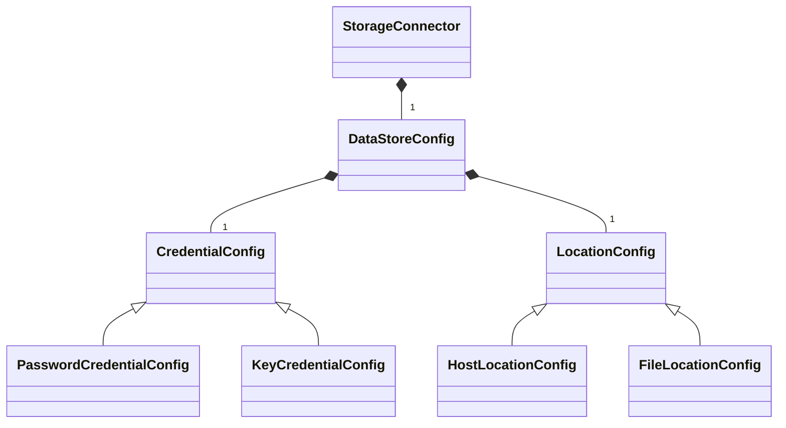
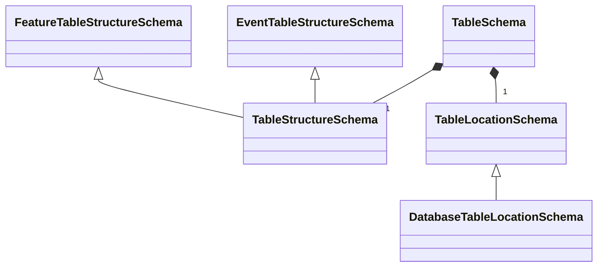

## `Config` Categories and Classes

### `games` Configs

```{mermaid}
---
title: games Configs
---
classDiagram
    note "Showing subsets of public properties"
    class Config
    class GameGeneratorsConfig {
        + GameID
        + Detectors : DetectorMapConfig
        + Extractors : ExtractorMapConfig
        + LevelRange
        + OtherRanges : Dict[str, range]
    }
    class FeatureMapConfig {
        + AggregateFeatures
        + PerCountFeatures
        + LegacyPerLevelFeatures
        + LegacyMode : bool
    }
    class DetectorMapConfig {
        + AggregateDetectors
        + PerCountDetectors
        + PerLevelDetectors
    }
    class GeneratorConfig
    class FeatureConfig
    class DetectorConfig
    class SubfeatureConfig {
        + ReturnType
        + Description
    }
    class DetectorConfig {
        + Enabled
        + Description
        + ReturnType
        + Subfeatures
    }
    class AggregateConfig {
        + Enabled
        + Description
        + ReturnType
        + Subfeatures
    }
    class PerCountConfig {
        + Enabled
        + Description
        + Prefix
        + Count
        + ReturnType
        + Subfeatures
    }
    GameGeneratorsConfig *-- DetectorMapConfig
    GameGeneratorsConfig *-- FeatureMapConfig
    DetectorMapConfig o-- DetectorConfig
    FeatureMapConfig o-- AggregateConfig
    FeatureMapConfig o-- PerCountConfig
    GeneratorConfig <|-- DetectorConfig
    GeneratorConfig <|-- FeatureConfig
    FeatureConfig <|-- AggregateConfig
    FeatureConfig <|-- PerCountConfig
    AggregateConfig *-- SubfeatureConfig
    PerCountConfig *-- SubfeatureConfig
```

### `Config` Classes in OGD-Common Library

### Storage Config Schemas

With the hierarchy separating connection from data read/write, we can also improve how configs are set up.

So, with the new class hierarchy, we should also have a more formal splitting up of configs and schemas, and then let core adjust to what makes sense for common.

First, we separate the "config" portion, which defines the data source and/or destination.
In particular, each `StorageConnector` will take a `DataStoreConfig` that has a location and credential to access the storage. `DataStoreConfig` will be a base class, though not necessarily abstract, with subclasses written to pair with individual, specific `StorageConnector` subclasses, which will check for the appropriate `DataStoreConfig` subclass.
That way, we can support configs being specific to storage type.

#### Credential Configs

For the "credential" element of a config schema, we'll have a `CredentialConfig` base class, with subclasses for `PasswordCredentialConfig` containing a username-password pair, as well as a `KeyCredentialConfig` with just a path to a key file. These can be expanded as needed.

#### Location Configs

For the "location" element of a config schema, we'll have a `LocationConfig` base class, which has just a "location" string. Subclasses include `HostLocationConfig`, which will add a port and a "host" prop mapped to location var; and `FileLocationConfig`, which will add a folder path, call "location" the file path, but treat combined path as the true "location." Or something like that.

#### Overview of New Storage Configs

The resulting diagram looks like:



### Interface Schemas

So, if the `DataStoreConfig`s have the information to connect to a storage location, the actual interface/outerface classes need information to locate the necessary data within that location.
These will be "schemas" in the sense defined by #64, as they describe the structure of a resource, rather than configuring how/where to connect to the resource.
For that, we'll have a `TableSchema` that includes both a `TableStructureSchema` and a `TableLocationSchema`.

#### Table Structure Schemas

The `TableStructureSchema` is the thing currently called `TableSchema`.
It will have subclasses for `EventTableStructureSchema` and `FeatureTableStructureSchema`, which look for event-specific and feature-specific columns.

#### Table Location Schemas

A `TableLocationSchema` has whatever information is needed to locate the table within the given resource.
The main subclass would be `DatabaseTableLocationSchema`, which would have a database and a table.



## Configuration Wrapper

All of the various configs and schemas can be wrapped in a `GameDataConfig` or something, which has schemas defining all the input (or all the output) info for a given game. This means up to two `TableSchema`s, where one is for events and the other for features.

